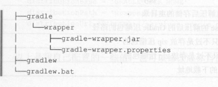
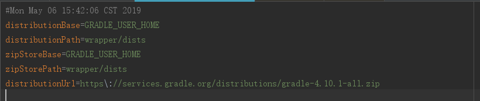
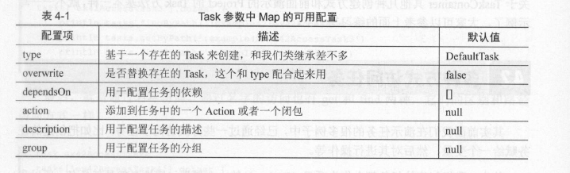

# Gradle  

## 前言 ##
通过这一段时间对Gradle的学习，尤其是对于《Android Gradle权威指南》和官方文档的学习，让我对平时经常使用而又一知半解的Gradle有了一个新的认识。在此做一个简单的总结，希望能帮助和我一样对Gradle不是很了解的小伙伴在日常使用上更加得心应手。

## 简介 ##
Gradle是一个基于Apache Ant和Apache Maven概念的项目自动化建构工具。它使用一种基于Groovy的特定领域语言来声明项目设置，而不是传统的XML。
当前其支持的语言限于Java、Groovy和Scala，计划未来将支持更多的语言。
——来自[维基百科](https://zh.wikipedia.org/zh-hans/Gradle)
## Gradle环境配置和使用 ##

### 环境配置 ###
说到Gradle，首先必不可少的就是环境的配置，必须配置**Java环境**和**Gradle环境**。  
配置Gradle之前请确保已经配置好Java环境，要求JDK6以上并且在环境变量中配置了JAVA_HOME。  
这里只介绍windows系统下搭建Gradle，其他系统请参考链接[Mac](https://www.jianshu.com/p/e9d035f30876)、[Linux](https://blog.csdn.net/yzpbright/article/details/53359855)。  

首先先从[Gradle官网](https://gradle.org/)下载SDK，目前最新的Gradle版本为5.4.1（Apr 26, 2019），然后下载complete版本，也就是说里面包含了GradleSDK的相关内容，包括源代码、文档、示例等。  
要运行Gradle,必须配置GRADLE_HOME，添加GRADLE_HOME环境变量，然后把
GRADLE_HOME\bin添加到PATH系统变量里保存即可。完成后打开CMD运行gradle -v来验证一下。
```
------------------------------------------------------------
Gradle 4.10.1
------------------------------------------------------------

Build time:   2018-09-12 11:33:27 UTC
Revision:     76c9179ea9bddc32810f9125ad97c3315c544919

Kotlin DSL:   1.0-rc-6
Kotlin:       1.2.61
Groovy:       2.4.15
Ant:          Apache Ant(TM) version 1.9.11 compiled on March 23 2018
JVM:          1.8.0_152-release (JetBrains s.r.o 25.152-b01)
OS:           Windows 10 10.0 amd64

```
### Gradle使用 ###

环境搭建好后，按照惯例首先来一次HelloWorld，创建一个build.gradle文件，输入以下内容：
```groovy
task hello{
	println 'Hello World'
}
```
然后在命令行输出：
```
$ gradle -q hello
Hello World
```
在这里简单分析一下gradle的执行原理，build.gradle是Gradle默认的构建执行脚本文件，执行Gradle命令时，会默认加载当前目录下的build.gradle脚本文件。**这里也通过-b参数加载指定的脚本文件**，例如加载Demo中的hello.gradle文件：
```
$ gradle -b hello.gradle -q hello
Hello World
```
然后通过gradle -q命令，来指定需要执行build.gradle对应的某个task任务，-q 安静模式,不输出日志。   
这种使用方式有一个最大的弊端，就是当团队开发时，很难对于Gradle的版本进行统一管理，可以会出现由于Gradle版本不统一所引发的问题。所以在项目中都是使用**Gradle Wrapper**，其实就是对Gradle进行一次包装，在Android Studio项目中的gradle文件夹，就是一个生成好的Gradle Wrapper，用于管理gradle的版本。  
通过Gradle内置的Wrapper Task可以帮助我们自动生成Wrapper所需的目录文件，在项目根目录下命令行输入gradle wrapper,生成gradle文件夹,目录如下：  
   
- **gradlew**和**gradlew.bat**分别为Linux和Windows下的可执行脚本，他们的用法和Gradle指令一样。
- **gradle-wrapper.jar**是具体业务逻辑实现的jar包，gradlew最终使用这个jar来执行Gradle操作。
- **gradle-wrapper.properties**是配置文件，用于管理所使用的Gradle的版本，配置Gradle下载地址、zip存放地址以及解压地址。
   


## Groovy 基础
Groovy是基于JVM虚拟机的一种动态语言，它的语法和Java非常相似，Groovy可以完全兼容Java，即可以在build脚本中写任何的Java代码，又在此基础上增加了很多动态类型和灵活的特性，比如支持闭包、DSL，可以说它是一门非常灵活的动态脚本语言。   
咱们这里主要了解一些简单的概念：字符串、集合、方法以及闭包，这些也是所有语法最基础的部分，可以更好的帮助我们了解Groovy语法，为后期Gradle的学习和使用打下个基础。
### 字符串 ###
首先说明一下，在Groovy中分号不是必需的，与Java不同Groovy没有这个强制规定，所以Gradle脚本中很多都没有分号，这个是Groovy的特性。   
在Groovy中，**单引号**和**双引号**
都可以定义一个字符串常量，不同的是**单引号**标记的是纯粹的字符串常量，**双引号**除此之外还可以直接进行表达式运算。   
```groovy
task printStringClass {
    def strl = '单引号'
    def str2 = "双引号"
    println "单引号定义的字符串类型："+ strl.getClass().name
    println "双引号定义的字符串类型："+ strl.getClass().name
}
```
使用./gradlew printStringClass运行后可以看到：
```java
单引号定义的字符串类型： java.lang.String
双引号定义的字符串类型： java.lang.String
```
可以看出单引号和双引号输出的结果并没有区别，而针对于上面说到的表达式运算：
```groovy
task printStringVar {
    def var = 'Gavin'

    println "单引号的变量计算：${var}"
    println "双引号的变量计算：${var}"
}
```
./gradlew printStringVar 运行后输出：  
```
单引号的变量计算：${name}   
双引号的变量计算：张三
```
从结果可以看出单引号是直接输出，而双引号输出的是运算后的结果，我们讲可以通过双引号来进行表达式计算和字符串的拼接。   

### 集合 ###
Java中的集合在开发中经常被我们使用到，而Groovy完全兼容了Java的集合，并且进行了扩展，使得集合的声明和使用及其简单。在这里我们简单的介绍一下List和Map，如果大家想深入了解可以参考[Groovy working with collections](http://docs.groovy-lang.org/next/html/documentation/working-with-collections.html#JN1035-Maps-Collectionviewsofamap)。

-  #### List ####
您可以创建如下List。注意，[]是空列表表达式。

```groovy
task printList {
    //我们定义一个由逗号分隔、方括号包围的列表号，并将该List分配给一个变量
    def numbers = [1, 2, 3, 4, 5, 6]   
    //该集合是Java的Java.util.List的实例     
    println "List type:" + numbers.getClass().name
    //可以使用size()方法查询List的长度
    println "List size:" + numbers.size()
    //获取索引第二位的元素,List的索引也是从0开始
    println "List index 2:" + numbers[1]
    //获取索引最后一位的元素
    println "List index the last one:" + numbers[-1]
    //获取索引倒数第二位的元素
    println "List index the second-to-last:" + numbers[-2]
    //获取索引1和3的元素集合
    println "List index 1 and index3 : ${numbers[1,3]}"
    //获取索引2~4的元素集合
    println "List index 2~4 : ${numbers[2..4]}"
}
```   
./gradlew printList 运行后输出：
```
List type:class java.util.ArrayList
List size:6
List index 2:2
List index the last one:6
List index the second-to-last:5
List index 1 and index3 : [2, 4]
List index 2~4 : [3, 4, 5]
```
Groovy可以通过索引的方式进行访问，就像数组一样，除此之外，还提供了负索引和范围索
引。负索引代表从右边开始，-1就代表从右侧数第一个，-2代表从右侧数第二个，以此
类推： 1..3 这种是一个范围索引，中间用两个“ ．”分开， 这个会经常遇到。
此外，Groovy使用each方法为List提供了非常方便的迭代操作，
```groovy
	...
	numbers.each{
		//it 代表遍历出来的每个元素
		println it
	}
```
- #### Map ####
Map用法很多跟List比较像，在Groovy中可以使用map文字语法[:]:创建映射(也称为关联数组):
```groovy
task printMap {
    def map = ['name': 'Gromit', 'likes': 'cheese', 'id': 1234]
    //该集合是Java的java.util.LinkedHashMap的实例     
    println "Map type : ${map.getClass().name}"
    //通过size()过去Map长度
    println "Map size : ${map.size()}"
    //通过映射关系来获取指定key的value值
    println "Map name : ${map.name}"
    //通过类似数组的方法来获取指定key的value值
    println "Map likes : ${map['likes']}"
    //通过get方法来获取指定key的value值
    println "Map id : ${map.get("id")}"
    
    //遍历Map 可以通过key和value属性获取每个元素的key和value
    //只不过被送代的元素是一个Map.Entry的实例
    map.each {
	println "Key:${it.key}, Value:${it.value}"
    }
}
```
关于集合的使用就简单的说到这里，可以看出在Groovy中集合的使用时非常简单非常灵活，大家如果有兴趣可以参考[Groovy working with collections](http://docs.groovy-lang.org/next/html/documentation/working-with-collections.html#JN1035-Maps-Collectionviewsofamap)。

### 方法 ###
对于方法的调用，在Groovy中也比java更加简洁，在这里简单的说一下Groovy和Java使用方法的不同.
- 方法使用的简洁
- return可以省略
```groovy
//方法使用上的简洁
task invokeMethod {
    methodPlus(1,2)
    //在Groovy中更加简洁的用法 省略括号
    methodPlus 1,2
    def add1 = method2 2,3
    def add2 = method2 5,4
    println "max value : " + add1
    println "max value : " + add2
}

def methodPlus(int a, int b){
    println a+b
}

//return 可以省略
def method2(int a, int b){
    if(a > b){
	a
    }else{
	b
    }
}

//代码块 可以当作参数传递

```


### 闭包 ###
闭包是Groovy的一个非常重要的特性，闭包其实就是一段代码块，它可以使代码灵活、轻量、可复用。
- 定义闭包

```Groovy
	//其中[]内是可选的闭包参数，可省略。当闭包带有参数，就需要->来将参数和闭包体相分离。
	{ [closureParameters -> ] statements }
```
- 闭包的类型

闭包在groovy中是groovy.lang.Closure类的实例，这使得闭包可以赋值给变量或字段。
```Groovy
	def listener = { e -> 
		println "Clicked on $e.source" }   
   
	assert listener instanceof Closure

	Closure callback = { 
		println 'Done!' 
	}               
	Closure<Boolean> isTextFile = { File it -> 
		it.name.endsWith('.txt')                     
	}
```

- 单参数的闭包  

先写一个类似闭包的功能：

```Groovy
task helloClosure << {
	//使用我们自定义的闭包 把闭包当作参数传递
    customEach {
		println it
    }
}

def customEach (closure) {
    //模拟一个有10 个元素的集合，开始迭代 而参数i会被闭包接受。
    for (int i in 5..15) {
		closure(i)
    }
}
```
上面例子中我们定义了一个方法customEach，他只有一个参数，用于接受一个闭包（代码块），把闭包当作一个方法调用，括号里的参数就是该闭包接收的参数，如果只有一个参数，那么就是我们的变量it了。   

- 多参数闭包  

刚才上面说的单参数闭包，如字面意思，当闭包只有一个参数时，默认就是it；当有多个参数时，it就不能表示了，我们需要将参数一一列出：  

```Groovy
task helloClosure2 << {
    eachMap{k,v ->
        println "${k} is ${v}"
    }
}

def eachMap(closure){
    def map1 = ["name":"Gavin","age":18]
    map1.each {
	    closure(it.key,it.value)
    }
}
```
从上面的例子可以看出，闭包接受两个参数Map的key和value，所以要显示的声明出来。

- 闭包委托  

Groovy闭包的强大之处在于它支持闭包方法的委托，委托策略是groovy中闭包独有的语法，这也使得闭包较java的lambda更为高级。下面简单介绍一下groovy中的委托策略。  
Groovy的闭包有thisObject、owner、delegate三个属性：
> this 表示定义闭包的外围类,即闭包定义所在的类。  
> owner 表示定义闭包的直接外围对象，可以是类或者闭包。  
> delegate 表示闭包中引用的第三方对象。

当你在闭包内调用方法时，由他们来确定使用哪个对象来处理。默认情况delegate和owner是相同的，但是delegate是可以被修改的，这个功能非常强大的，Gradle中闭包的很多功能都是通过修改delgate实现。这里找了一篇对于闭包委托讲解比较全面的帖子，供大家参考：[简书地址](https://www.jianshu.com/p/6dc2074480b8)。


所以到这里，Groovy基础就先简单聊到这里，如果大家还想深入了解可以参考[Gradle Docs](http://groovy-lang.org/single-page-documentation.html)。

## Gradle构建脚本基础 ##
从这章开始正式介绍一下Gradle，主要会从三个方面介绍Gradle：**Gradle基础**、**Task**以及**自定义属性**，帮助大家能够快速入门Gradle。


### 1.Gradle基础 ### 
  
- **1.Settings.gradle**
  
settings文件是Gradle定义的一个设置文件，用于初始化和配置工程。设置文件的默认名字是settings.gradle，放在根工程目录下。   
如果一个工程下有多个子工程，只有在Settings文件里配置的子工程才能被Gradle识别，在构建的时候才能被包含进去。  
例如下面的Settings.gradle文件
```groovy
//Google Firebase Sample
include ':admob:app',':analytics:app',':app-indexing:app',':auth:app',
        ':config:app',':crash:app',':database:app',':dynamiclinks:app',
        ':firestore:app',':functions:app',':internal:chooser',
        ':internal:lint',':internal:lintchecks', ':inappmessaging:app',
        ':messaging:app',':mlkit:app',':mlkit-langid:app',
        ':perf:app',':storage:app'
//General App Sample
include ':app', ':data', ':common'
```
从Firebase的示例可以看出，项目中定义了很多子工程，每个子工程都有一个app的module项目，所以在配置的时候会指定相应目录和相应module项目，这样就能实现多个子工程的gradle初始化。  
从下面的示例可以看出，如果不指定目录，默认目录是其同级目录，例如':app'。  
**利用这个特性，我们可以把我们的项目放在任何目录下，只要在Settings文件中指定好路径，就可以非常灵活的对项目进行分级、分类。**

- **2.Build.gradle**   

一个项目中可能存在多个子工程，每个子工程构建都应该是相互独立的，也就是说，每个子工程都可以根据自己的需要，配置各种依赖，插件等。那么，Gradle 是如何分开来管理每个子工程的构建任务的呢？    
这就是 build.gradle 文件的作用了，所以你会发现，每个子工程，也就是每个 Module 都会有一个 build.gradle 文件，Gradle 就是以这个文件为根据来构建这个 Module。那么，如果有些配置项，在所有的子工程中都是一致的话，如果在每个子工程里都去重复粘贴的话，当这个共同的配置项需要发生变化时，维护起来会非常麻烦。而根目录下面的build.gradle是统筹全局的，在这里，你可以配置一些所有工程共同的配置项，比如 Android Gradle 的版本，依赖库的仓库地址这些所有工程的共同配置项。

### 2.Task任务 ### 
task 是 Gradle 中的一种概念，引用书中的解释：    
> 一个 task 其实就是一个操作，一个原子性的操作，比如打个 jar 包，复制一份文件，编译一次 Java 代码，上传一个 jar 到 Maven 中心库等，这就是一个 Task，和 Ant 里的 Target， Maven 中的 goal 是一样的。   

- **创建任务**
```Groovy
task customTask1 {
   doFirst {
	println 'customTask1 : first'
   }
   doLast {
	println 'customTask1 : last'
   }
}

//控制台输出
$ gradle -b GradleBasics.gradle -q customTask1   
customTask1 : first   
customTask1 : last
```
这里面Task是Project对象的一个函数，原型为create(String name,Closure configureClosure)。customTask1为任务的名字，我们可以自己定义，后面紧接着一个闭包，也就是大括号，根据之前闭包的了解，最后一个参数是闭包的时候，可以放到括号外并省略括号。例子中我们用了任务的**doFirst**和**doLast**方法，分别在任务执行前后输出一段文字。
```Groovy
//与上面的执行结果相同
tasks.create("customTask1") {
   doFirst {
	println 'customTask1 : first'
   }
   doLast {
	println 'customTask1 : last'
   }
}
```

- **任务依赖**   
任务直接是可以有依赖关系的，这样我们就能控制哪些任务先于哪些任务执行；哪些任务执行完了，其他任务才能执行。比如Android的install任务一定要依赖package任务进行打包生成apk，才能执行install任务：
```Groovy
task predecessorTask << {
   println "predecessor task execute."
}

task postpositionTask(dependsOn: predecessorTask){
   doLast{
       println "postposition task execute."
   }
}

//控制台输出

//直接执行前置任务
$ gradle -b GradleBasics.gradle -q predecessorTask
predecessor task execute.

//当执行后置任务时 会先执行前置任务
$ gradle -b GradleBasics.gradle -q postpositionTask
predecessor task execute.
postposition task execute.

```
从例子中我们可以看到，在创建任务的时候，通过 **dependsOn** 可以指定其依赖的任务。当然可以单依赖也可以多依赖：
```Groovy
task exTask1 << {
	println 'execute task1'
}

task exTask2 << {
	println 'execute task2'
}

task exMultiTask{
	dependsOn exTask1,exTask2
	doLast{
		print 'execute multi-task' 
	}
}

//控制台输出

$ gradle -b GradleBasics.gradle -q exMultiTask
execute task1
execute task2
execute multi-task

```
dependsOn是Task类的一个方法，可以接受多个依赖的任务作为参数。

- **任务间通过API控制、交互**
创建任务和我们定义变量一样，变量名就是我们定义的任务名，类型是Task。所以我们可以通过任务名，使用Task的API访问它的方法、属性等，这对于我们操作任务是非常方便灵活的。   
要使用任务名操作任务，必须先定义声明，因为脚本是顺序执行的：

```Groovy
task demoTask << {
	println 'execute demo task'
}

demoTask.doFirst {
	println 'do Frist'
}

demoTask.doLast {
	println 'do Last' 
}

//控制台输出

$ gradle -b GradleBasics.gradle -q demoTask
do Frist
execute demo task
do Last
```
如上示例，我们调用了doLast和doFirst方法，在任务执行前后做一些事情。对于直接通过任务名操纵任务的原理是：Project在创建该任务的时候，同时把该任务对应的任务名注册为Project的一个属性，类型是Task 。我们稍微改动一下例子程序，看看是否有这个属性：

```Groovy
task demoTask << {
	println 'execute demo task'
}

demoTask.doFirst {
	println 'do Frist'
}

demoTask.doLast {
	println project.hasProperty('demoTask')
	println 'do Last' 
}

//控制台输出
$ gradle -b GradleBasics.gradle -q demoTask
do Frist
execute demo task
true
do Last

```
task先简单说到这里，后面章节还会详细的说说Android中Task的使用。

- **自定义属性**

Project和Task都允许用户添加额外的自定义属性，要添加额外的属性，通过应用所属对应的ext属性即可实现。添加之后可以通过ext属性自定义属性读取和设置，如果要同时添加多个自定义属性，可以通过ext代码块：
```Groovy
//自定义一个Project参数
ext.age = 18

//通过代码块同时设置多个属性
ext {
	phone = "130xxxxxxxx"
	address = "Tianjin xxx"
}

task extTask {
	println "AgeL : ${age}"
	println "Phone Number : ${phone}"
	println "Address : ${address}"
}

//控制台输出
$ gradle -b GradleBasics.gradle -q extTask
AgeL : 18
Phone Number : 130xxxxxxxx
Address : Tianjin xxx

```
相比局部变量，自定义属性有更为广泛的作用域，你可以跨Project，跨Task访问这些自定义属性。只要你能访问这些属性所属的对象，那么这些属性都可以被访问到。   
从程序运行可见，我们自定义的属性都生效了。在我们的项目中一般使用它来自定义版本号和版本名称，把版本号和版本名称单独放在一个Gra dle文件中。因为它们每次发布版本都会改变，变动频繁，放到一个单独的Gradle文件中， 便于管理，而且改动的时候也不会因为Git冲突影响整个Build文件，便于解决冲突。  
此外，Gradle比其他脚本更加优秀的地方就是，它不只是一个脚本，你在使用过程中可以时刻使用Groovy、Java以及Gradle的任何语法和API帮你完成你想做的事，在这个文件上你可以定义Class、内部类、导入包、定义方法、常量、接口等等，灵活运用。

## Gradle任务 ##

上面已经简单说了一下Task的使用，接下来在进一步详细聊一下Gradle Task。

- **任务的创建**

在Gradle中，我们可以有很多种方法来创建任务，这都是依赖于Project给我们提供的方法以及TaskContainer提供的相关create方法。在我们阅读一些Gradle脚本时，很有可能看到一些不熟悉的创建任务的方法，所以我们再次统一介绍一下：

1. **使用任务名字创建任务**

```Groovy

//使用任务名字创建任务
def Task createTask1 = task(createTask1)

createTask1.doLast {
	println "Create method : task(String name)"
}

//控制台输出
$ gradle -b Task.gradle -q createTask1
Create method : task(String name)

```
从例子中可以看出 createTask1就是我们的任务名称，这种方式的创建其实是调用Project对象中的task(String name)的方法。

2. **使用任务名字＋任务配置的Map对象来创建任务**

```Groovy

//使用任务名字＋任务配置的Map对象来创建任务
def Task createTask2 = task(createTask2,group:BasePlugin.BUILD_GROUP)

createTask2.doLast {
	println "Create method : task(String name, Map<String,?> args)"
}

//控制台输出
$ gradle -b Task.gradle -q createTask2
Create method : task(String name, Map<String,?> args)

```
相比第一种方法，只是多一个Map参数，用于对要创建的Task进行配置。上面的代码作用是将createTask2任务加入到Build组中，下图是Task中Map的可用配置介绍：
 


3. **使用任务名字＋闭包来创建任务**
```Groovy

//使用任务名字＋闭包来创建任务
task createTask3 {
	description 'Create Task Demo 3'
	doLast {
		println "Create method : task(String name, Closure configureClosure)"
		println "task description : ${description}"
	}
}

//控制台输出
$ gradle -b Task.gradle -q createTask3
Create method : task(String name, Closure configureClosure)
task description : Create Task Demo 3

```
第三种创建方法是最为常见的方法，较第二种方法，可以更灵活的在闭包中去配置任务，而且闭包中委托的对象是Task，所以可以使用Task的任务方法和属性，例如description等。

4. **使用TaskContainer来创建任务**
```Groovy

//使用TaskContainer来创建任务
tasks.create('createTask4') {
	description 'Create Task Demo 4'
	doLast {
		println "Create method : Task create(String name, Closure configureClosure) throws InvalidUserDataException"
		println "task description : ${description}"
	}
}

//控制台输出
$ gradle -b Task.gradle -q createTask4
Create method : Task create(String name, Closure configureClosure) throws InvalidUserDataException
task description : Create Task Demo 4

```
其实对于第四种方法，其实上面的方法在源码中最终都会调用TaskContrainer对象中的create方法，其参数和Project中的Task方法基本一样。tasks是Project对象的属性，其类型是TaskContainer，我们可以直接使用它来创建任务。


- **任务的分组和描述**

任务是可以进行分组和添加描述的，分组的功能是便于对任务的归类整理，而描述是说明这个任务有什么作用，起到一个解释说明的作用。建议大家在创建任务时，这两个都要配置，以便方便他人了解你的创建任务的用意：
```Groovy
def Task groupTask = task(groupTask)

groupTask.group = BasePlugin.BUILD_GROUP
groupTask.description = "This is a guided task"
groupTask.doLast {
	println "group:${group},description:${description}"
}

//控制台输出
$ gradle -b Task.gradle -q groupTask
group:build,description:This is a guided task

```
- **任务排序**

对于任务来说，并没有真正的排序功能，而是通过shouldRunAfter和mustRunAfter来控制一个任务应该或者必须在某个人物执行之后执行。通过这种方式你可以在某些情况下控制任务的执行顺序。  
这个功能是非常有用的，可能场景是必须先执行单元测试，然后才能进行打包，这就保证了App 的质量。类似情况还有很多，比如必须要单元测试之后才能进行集成测试，打包成功之后才能进行部署发布等。  
taskB.shouldRunAfter(task.A）表示taskB 应该在task.A 执行之后执行，这里的应该而不是必须。所以有可能任务顺序并不会按预设的执行。
taskB.mustRunAfter(task.A ）表示taskB 必须在task.A 执行之后执行，这个规则就比较严格。
```Groovy
//任务排序

task firstTask << {
	println "firstTask execute"
}

task secondTask << {
	println "secondTask execute"
}

//控制台输出
$ gradle -b Task.gradle -q firstTask secondTask
firstTask execute
secondTask execute

```
当加入了mustRunAfter之后：
```Groovy
task firstTask << {
	println "firstTask execute"
}

task secondTask << {
	println "secondTask execute"
}

firstTask.mustRunAfter(secondTask)

//控制台输出
$ gradle -b Task.gradle -q firstTask secondTask
secondTask execute
firstTask execute

```
所以在实际开发中，通过mustRunAfter可以强制规定Task的执行顺序，对于某些场景是非常好用的。

- **任务的启用和禁用**

Task中有个enable属性，用于启动和禁用任务，默认是true，表示启用；设置为false，则禁止该任务执行，输出会提示该任务被跳过：
```Groovy

task enableTask << {
	println 'enableTask' 
}
enableTask.enable = false

```
在某些情况下，可以通过该属性灵活控制任务的执行，这种方式需要在执行到具体逻辑的时候才能进行判断设置。

- **任务的onlyIf断言**

断言和上面讲到的任务启动禁用效果一样，只不过它与启用禁用相比，他的提前进行判断来控制任务是否执行。onlyIf它接受一个闭包作为参数，如果该闭包返回true则该任务执行，否则跳过。可以控制在某些时刻执行什么任务。现在用一段伪代码来模拟打包的功能。  
假设一个构建渠道包的场景
```Groovy
//任务的onlyIf断言
//创建构建任务的type
final String BUILD_APPS_ALL = "all"
final String BUILD_APPS_ONLY_ONE = "only_one"
final String BUILD_APPS_ONLY_TWO = "only_two"

//构建第一个渠道的Task
task exOneTask << {
	println "package one"
}

//构建第二个渠道的Task
task exTwoTask << {
	println "package two"
}

//模拟build任务
task build {
	group BasePlugin.BUILD_GROUP
	description " package channl apk"
}
//模拟build任务 指定依赖exOneTask和exTwoTask
build.dependsOn exOneTask,exTwoTask

exOneTask.onlyIf {
	def execute = false
	if(project.hasProperty("build_apps")){
	   Object buildApps = project.property("build_apps")
	   if(BUILD_APPS_ONLY_ONE.equals(buildApps) || BUILD_APPS_ALL.equals(buildApps)){
	   	execute = true
	   }else{
		execute = false
	   }
	}else {
	   execute = true
	}
	execute
}

exTwoTask.onlyIf {
	def execute = false
	if(project.hasProperty("build_apps")){
	   Object buildApps = project.property("build_apps")
	   if(BUILD_APPS_ONLY_TWO.equals(buildApps) || BUILD_APPS_ALL.equals(buildApps)){
	   	execute = true
	   }else{
		execute = false
	   }
	}else {
	   execute = true
	}
	execute
}
```
控制台输出：
```Groovy
//全输出
$ gradle -b Task.gradle -Pbuild_apps=all -q build
package one
package two
//只输出exTaskOne
$ gradle -b Task.gradle -Pbuild_apps=only_one -q build
package one
//只输出exTaskTwo
$ gradle -b Task.gradle -Pbuild_apps=only_two -q build
package two

```
可以看出通过断言可以有效控制任务的执行，可以更加灵活的进行任务的配置。其中命令行中-P的意思是为Project 指定Key-Vaule格式的属性键值对，使用格式为-PK=V 。

当前为第一阶段的收尾，Gradle的其他功将会在第二阶段继续补充。